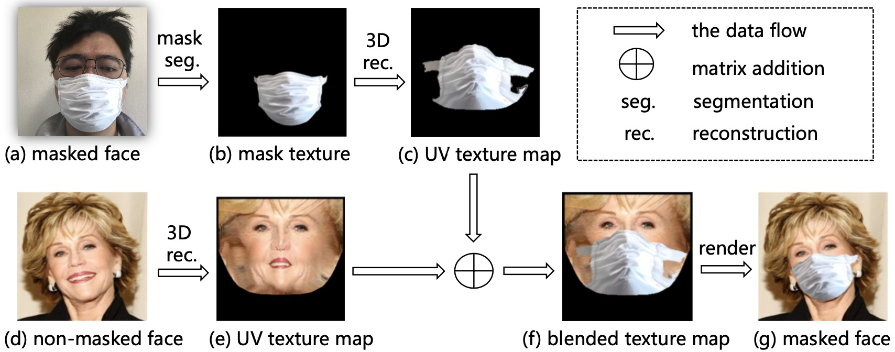

# FMA-3D
A method for adding a mask on a non-masked face image. Given a real masked face image (a) and a non-masked face image (d), we synthesize a photo-realistic masked face image with the mask from (a) and the facial area from (d). 


# Some Results by FMA-3D


# Requirements
* python >= 3.7.1
* pytorch >= 1.1.0
* dlib >= 19.19.0

# Usage
* Extract the landmarks.
You can extract the 106 landmarks by our [face sdk](../../../face_sdk) or any other methods.
* Add a mask on a face image.
You can refer to [add_mask_one.py](add_mask_one.py) as an example.
```sh
python add_mask_one.py
```

* Add mask templates on cropped face images from assigned folder.
download shape_predictor_68_face_landmarks.dat to FaceX-Zoo/addition_module/face_mask_adding/FMA-3D.
```sh
python add_mask_to_crop_dataset.py
```

# Note
If you use a different version of Python, you should rebuild the mesh_core_cython.so as descriped in [face3d](https://github.com/YadiraF/face3d), 
```sh
cd utils/mesh/cython
python setup.py build_ext -i 
```

# Reference  
This project is mainly inspired by [PRNet](https://github.com/YadiraF/PRNet), [face3d](https://github.com/YadiraF/face3d) and [pytorch-prnet](https://github.com/liguohao96/pytorch-prnet)
